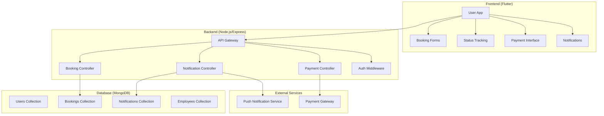
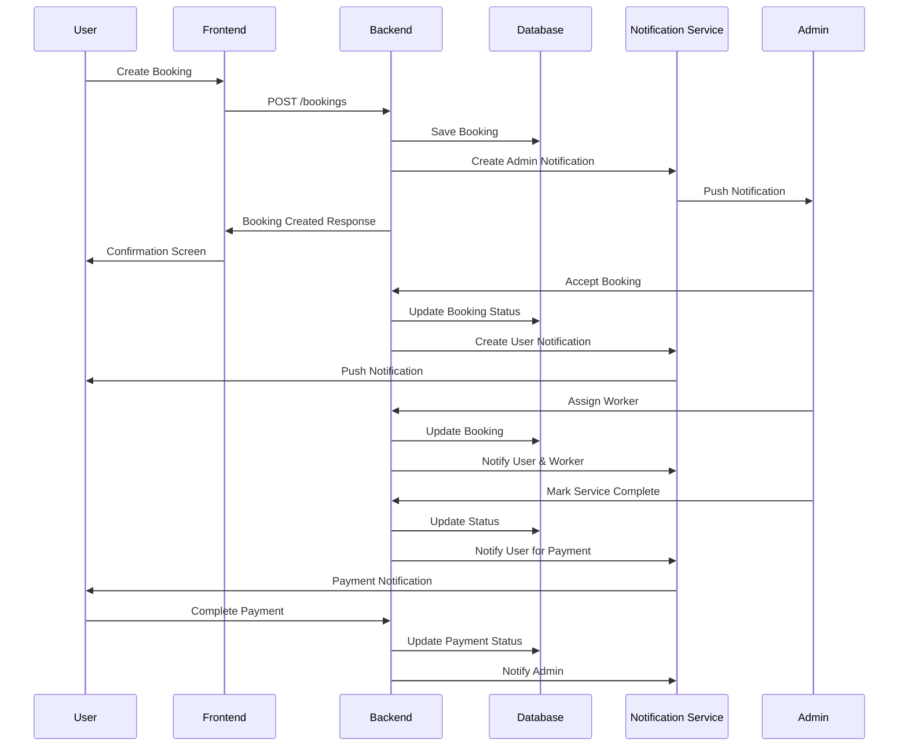

# Design Document

## Overview

The Service Booking Workflow system is a comprehensive solution that manages the complete lifecycle of service bookings from initial user request to final payment completion. The system consists of a Flutter mobile application frontend and a Node.js/Express backend with MongoDB database, implementing real-time notifications and status tracking throughout the service delivery process.

The workflow involves three main actors: Users (customers), Admins (service coordinators), and Workers (service technicians). The system orchestrates interactions between these actors through a series of status transitions and notifications.

## Architecture

### High-Level Architecture



### System Components

1. **Flutter Frontend**: Mobile application providing user interfaces for booking creation, status tracking, and payment processing
2. **Node.js Backend**: RESTful API server handling business logic, data persistence, and external service integration
3. **MongoDB Database**: Document-based storage for users, bookings, notifications, and employee data
4. **Notification System**: Real-time notification delivery using push notifications and in-app messaging
5. **Payment Integration**: Secure payment processing with multiple payment method support

## Components and Interfaces

### Frontend Components

#### 1. Booking Management Components
- **BookingFormScreen**: Service selection and booking detail input
- **BookingStatusScreen**: Real-time status tracking and updates
- **BookingHistoryScreen**: Historical booking records and details

#### 2. Notification Components
- **NotificationService**: Local notification handling and display
- **NotificationProvider**: State management for notification data
- **NotificationScreen**: Notification history and management

#### 3. Payment Components
- **PaymentScreen**: Payment method selection and processing
- **PaymentConfirmationScreen**: Payment success/failure handling

#### 4. Admin Components
- **AdminDashboard**: Booking overview and management interface
- **WorkerAssignmentScreen**: Employee assignment and tracking
- **BookingActionScreen**: Accept/reject booking decisions

### Backend Components

#### 1. API Controllers
- **BookingController**: Handles all booking-related operations
- **NotificationController**: Manages notification creation and delivery
- **PaymentController**: Processes payment transactions
- **EmployeeController**: Manages worker assignments and availability

#### 2. Services
- **NotificationService**: Centralized notification logic and delivery
- **PaymentService**: Payment processing and validation
- **BookingStatusService**: Status transition management and validation

#### 3. Middleware
- **AuthMiddleware**: JWT token validation and user authentication
- **ValidationMiddleware**: Request data validation and sanitization
- **ErrorHandlingMiddleware**: Centralized error processing and logging

### Data Flow Architecture



## Data Models

### Booking Model (Enhanced)

```javascript
{
  _id: ObjectId,
  user: ObjectId, // Reference to User
  serviceType: String, // 'water_purifier', 'ac_repair', 'refrigerator_repair'
  customerName: String,
  customerPhone: String,
  customerAddress: String,
  description: String,
  preferredDate: Date,
  preferredTime: String,
  
  // Status Management
  status: String, // 'pending', 'accepted', 'rejected', 'assigned', 'in_progress', 'completed', 'cancelled'
  statusHistory: [{
    status: String,
    timestamp: Date,
    updatedBy: ObjectId,
    notes: String
  }],
  
  // Worker Assignment
  assignedEmployee: ObjectId, // Reference to Employee
  assignedDate: Date,
  
  // Timeline Tracking
  acceptedDate: Date,
  rejectedDate: Date,
  startedDate: Date,
  completedDate: Date,
  
  // Payment Information
  paymentStatus: String, // 'pending', 'paid', 'failed'
  paymentMethod: String, // 'cash_on_service', 'online', 'cash_on_hand'
  paymentAmount: Number,
  actualAmount: Number,
  paymentTransactionId: String,
  
  // Notes and Communication
  adminNotes: String,
  workerNotes: String,
  rejectionReason: String,
  
  // Metadata
  createdAt: Date,
  updatedAt: Date
}
```

### Notification Model (Enhanced)

```javascript
{
  _id: ObjectId,
  title: String,
  message: String,
  type: String, // 'booking_created', 'booking_accepted', 'booking_rejected', 'worker_assigned', 'service_completed', 'payment_required', 'payment_received'
  recipient: String, // 'admin', 'user', 'worker', 'all'
  
  // Relationships
  relatedBooking: ObjectId,
  relatedUser: ObjectId,
  relatedEmployee: ObjectId,
  
  // Status
  isRead: Boolean,
  readAt: Date,
  
  // Priority and Delivery
  priority: String, // 'low', 'medium', 'high', 'urgent'
  deliveryMethod: String, // 'push', 'in_app', 'both'
  deliveryStatus: String, // 'pending', 'sent', 'delivered', 'failed'
  
  // Additional Data
  data: Object, // Additional context data
  actionRequired: Boolean, // Whether notification requires user action
  actionUrl: String, // Deep link for action
  
  createdAt: Date,
  updatedAt: Date
}
```

### Employee Model (Enhanced)

```javascript
{
  _id: ObjectId,
  name: String,
  phone: String,
  email: String,
  
  // Service Capabilities
  serviceTypes: [String], // Services this employee can handle
  skillLevel: String, // 'junior', 'senior', 'expert'
  
  // Availability
  isAvailable: Boolean,
  currentBookings: [ObjectId], // Active bookings assigned
  maxConcurrentBookings: Number,
  
  // Performance Tracking
  completedBookings: Number,
  averageRating: Number,
  totalEarnings: Number,
  
  // Status
  isActive: Boolean,
  lastActiveDate: Date,
  
  createdAt: Date,
  updatedAt: Date
}
```

### Payment Transaction Model

```javascript
{
  _id: ObjectId,
  booking: ObjectId,
  user: ObjectId,
  
  // Transaction Details
  amount: Number,
  paymentMethod: String,
  transactionId: String,
  gatewayTransactionId: String,
  
  // Status
  status: String, // 'pending', 'processing', 'completed', 'failed', 'refunded'
  
  // Gateway Response
  gatewayResponse: Object,
  failureReason: String,
  
  // Timestamps
  initiatedAt: Date,
  completedAt: Date,
  
  createdAt: Date,
  updatedAt: Date
}
```

## Error Handling

### Frontend Error Handling

1. **Network Errors**: Retry mechanism with exponential backoff
2. **Validation Errors**: Real-time form validation with user-friendly messages
3. **Authentication Errors**: Automatic token refresh and re-authentication
4. **Payment Errors**: Clear error messages with retry options
5. **Offline Handling**: Local data caching and sync when online

### Backend Error Handling

1. **Validation Errors**: Comprehensive input validation with detailed error responses
2. **Database Errors**: Connection pooling and automatic retry for transient failures
3. **External Service Errors**: Circuit breaker pattern for payment and notification services
4. **Authentication Errors**: JWT token validation with proper error codes
5. **Rate Limiting**: API rate limiting to prevent abuse

### Error Response Format

```javascript
{
  success: false,
  error: {
    code: "BOOKING_NOT_FOUND",
    message: "The requested booking could not be found",
    details: {
      bookingId: "64a7b8c9d1e2f3g4h5i6j7k8",
      userId: "64a7b8c9d1e2f3g4h5i6j7k9"
    }
  },
  timestamp: "2024-01-15T10:30:00Z"
}
```

## Testing Strategy

### Frontend Testing

1. **Unit Tests**: Individual component and service testing using Flutter test framework
2. **Widget Tests**: UI component testing with mock data
3. **Integration Tests**: End-to-end user flow testing
4. **Performance Tests**: Memory usage and rendering performance testing

### Backend Testing

1. **Unit Tests**: Individual function and service testing using Jest
2. **Integration Tests**: API endpoint testing with test database
3. **Load Tests**: Performance testing under high concurrent load
4. **Security Tests**: Authentication and authorization testing

### Test Coverage Requirements

- Frontend: Minimum 80% code coverage
- Backend: Minimum 85% code coverage
- Critical paths: 100% coverage (payment processing, booking status transitions)

### Testing Environments

1. **Development**: Local testing with mock services
2. **Staging**: Full integration testing with production-like data
3. **Production**: Monitoring and alerting for real-time issue detection

## Security Considerations

### Authentication and Authorization

1. **JWT Tokens**: Secure token-based authentication with refresh mechanism
2. **Role-Based Access**: Different permissions for users, admins, and workers
3. **API Rate Limiting**: Prevent abuse and DDoS attacks
4. **Input Validation**: Comprehensive server-side validation

### Data Protection

1. **Encryption**: All sensitive data encrypted at rest and in transit
2. **PII Handling**: Proper handling of personally identifiable information
3. **Payment Security**: PCI DSS compliance for payment processing
4. **Audit Logging**: Comprehensive logging of all system actions

### Mobile Security

1. **Certificate Pinning**: Prevent man-in-the-middle attacks
2. **Secure Storage**: Encrypted local storage for sensitive data
3. **Biometric Authentication**: Optional biometric login for enhanced security
4. **App Integrity**: Code obfuscation and anti-tampering measures

## Performance Optimization

### Frontend Optimization

1. **Lazy Loading**: Load screens and data on demand
2. **Image Optimization**: Compressed images with caching
3. **State Management**: Efficient state management with Provider pattern
4. **Memory Management**: Proper disposal of resources and listeners

### Backend Optimization

1. **Database Indexing**: Optimized indexes for frequent queries
2. **Caching**: Redis caching for frequently accessed data
3. **Connection Pooling**: Efficient database connection management
4. **API Optimization**: Pagination and filtering for large datasets

### Real-time Features

1. **WebSocket Connections**: Efficient real-time communication
2. **Push Notifications**: Optimized notification delivery
3. **Background Sync**: Efficient data synchronization
4. **Offline Support**: Local data storage and sync capabilities

## Scalability Design

### Horizontal Scaling

1. **Microservices Architecture**: Separate services for different domains
2. **Load Balancing**: Distribute traffic across multiple server instances
3. **Database Sharding**: Partition data across multiple database instances
4. **CDN Integration**: Content delivery network for static assets

### Monitoring and Analytics

1. **Application Monitoring**: Real-time performance and error tracking
2. **Business Analytics**: Booking patterns and user behavior analysis
3. **System Metrics**: Server performance and resource utilization
4. **Alerting**: Automated alerts for critical issues and thresholds